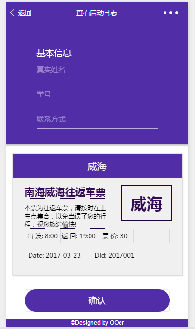

# Shuttles
微信小程序开发初体验项目——用于BJTU周末shuttle bus预定。 
该程序仅作为开发娱乐体验。。内部文件结构参数设计的不合理之处请见谅。(以及众多未知BUG) 
## 部署

**wxtour** 为前端部分，由微信开发客户端上传。 
其余部分上传至服务器**(https)**即可。 
初步测试在CentOS+Nginx+Mysql+PHP(**腾讯云小程序解决方案**)的环境下成功 

## Demo

### 主页

### 已购买/预定的车票

### 购买/预定车票

### 确认并提交信息

